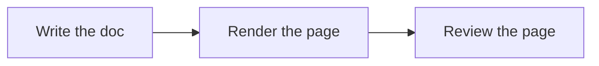

# Quoted diagram with a phrase that is not in it

```mermaid
flowchart LR
  A[Write the doc] --> B[Render the page] --> C[Review the page]
```

{>>[c1] Quy: "Ship the page" → is this the release step?<<}
