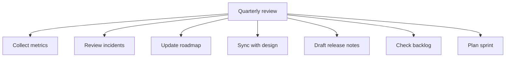

# Fitting diagram

The same fan-out with short labels: the wide layout is about 1120 px.

```mermaid
flowchart TD
  Root[Quarterly review] --> N0[Collect metrics]
  Root --> N1[Review incidents]
  Root --> N2[Update roadmap]
  Root --> N3[Sync with design]
  Root --> N4[Draft release notes]
  Root --> N5[Check backlog]
  Root --> N6[Plan sprint]
```
