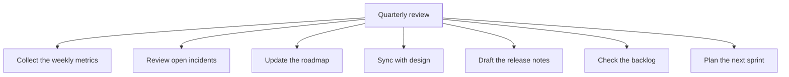

# Wide diagram

One node fans out to seven steps, so the wide layout is over 1300 px.

```mermaid
flowchart TD
  Root[Quarterly review] --> N0[Collect the weekly metrics]
  Root --> N1[Review open incidents]
  Root --> N2[Update the roadmap]
  Root --> N3[Sync with design]
  Root --> N4[Draft the release notes]
  Root --> N5[Check the backlog]
  Root --> N6[Plan the next sprint]
```
